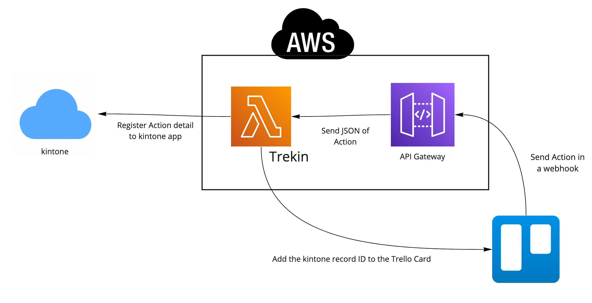
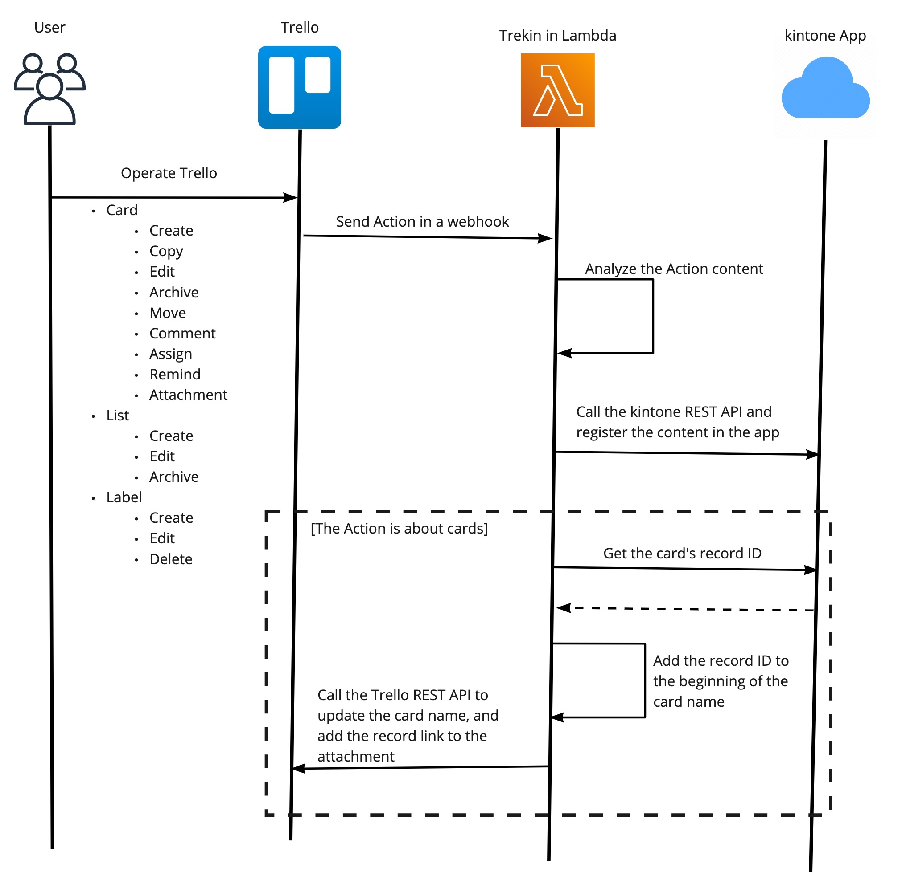

# trekin
A npm library that connects Trello to kintone.

[](https://www.npmjs.com/package/trekin) [](https://github.com/korosuke613/trekin/actions?query=workflow%3ACI) [](https://codecov.io/gh/korosuke613/trekin) [](https://app.fossa.com/projects/git%2Bgithub.com%2Fkorosuke613%2Ftrekin?ref=badge_shield)





See here for sample code for transcribing Trello Card to kintone using Trekin.
https://github.com/korosuke613/trekin-sample

## Installation

Use the package manager [npm](https://docs.npmjs.com/about-npm/) to install trekin.

```bash
npm i trekin
```

## Supported Trello events
- createCard
- updateCard
- copyCard
- createList
- updateList
- createLabel
- updateLabel
- addLabelToCard
- removeLabelFromCard
- addMemberToCard
- removeMemberFromCard
- commentCard
- addAttachmentToCard

https://developer.atlassian.com/cloud/trello/guides/rest-api/action-types/

## Usage

### Instantiation Trekin
```typescript
import { Trekin } from "trekin";

const trekin = new Trekin(
  {
    baseUrl: "https://example.cybozu.com/", // Your domain
    defaultKintoneUserCode: "john",  // Your kintone user code
    cards: {
      id: "1", // Your kintone app ID for Card
      token: "...", // Your kintone app API token for Card
    },
    labels: {
      id: "2", // Your kintone app ID for Label
      token: "...", // Your kintone app API token for Label
    },
    lists: {
      id: "3", // Your kintone app ID for List
      token: "...", // Your kintone app API token for List
    },
    members: {
      id: "4", // Your kintone app ID for Member
      token: "...", // Your kintone app API token for Member
    },
  },
  {
    apiKey: "...", // Your Trello user API key
    apiToken: "...", // Your Trello user API token
  }
);
```

### Storing Trello events in Objects
Turn [Trello's webhook response](https://developer.atlassian.com/cloud/trello/guides/rest-api/webhooks/#example-webhook-response) into an object.

```typescript
const trelloWebhookAction: Action = JSON.parse(
  await fs.readFileSync("trelloEvent.json", "utf8")
).body.action;
```

### Post Trello events to kintone

```typescript
const result = await trekin.operation(trelloWebhookAction);
console.info("Operation\n" + JSON.stringify(result));
```

### Post kintone events to Trello

```typescript
const postResult = await trekin.postOperation(trelloWebhookAction);
console.info("Post operation\n" + JSON.stringify(postResult));
```

### Setting of trekin

#### Exclude Card
Trekin support Card exclusion settings.
If all the conditions enclosed in braces are met, the event is skipped.

|option|type|default|description|
|---|---|---|---|
|charactersOrLess|number| |If the card name is less than or equal to the set value, exclude it.|
|match|regexp| |If the card name matches to the set regular expression, exclude it.|

###### example

```typescript
trekin.guardian.setting = {
  excludes: [
    {
      charactersOrLess: 12,
      match: "\\d{2}\\/\\d{2}\\/\\d{4}",
    },
    {
      match: "Test!!"
    }
  ],
};
```

- Card name is *⬆️27/09/2020*, skip.
- Card name is *Prepare for the event on 27/09/2020.*, not skip.
- Card name is *This is createCard Test!!*, skip.

##### Enable become Done time
Trekin can add the date and time the card was moved to the Done list to the record. It needs to be turned on in the settings.

|option|type|default|description|
|---|---|---|---|
|isAddDoneTime|boolean|false|Register the date and time the card was moved to the Done list in the record.|
|doneListName|string|"Done"|The list name corresponding to "Done".|


###### example
```typescript
trekin.guardian.setting = {
  isAddDoneTime: true,
  doneListName: "🎉Done"
};
```

1. Move card at 2020/11/30 13:00(UTC). (`👦Todo`→`🎉Done`)
2. Update Record. (Done time: `2020/11/30 13:00`)

##### Utilize kintone's record ID linking feature
Trekin gives the record ID to the top of the card. By assigning a record ID, you can use kintone's record ID link feature.

|option|type|default|description|
|---|---|---|---|
|prefixRecordId|string|"DEFAULT"|Record ID prefix name|


###### example

```typescript
trekin.guardian.setting = {
  prefixRecordId: "EPTRE",
};
```

1. Create Card. (Card name: `This is test`)
2. Add Card to Record. (Record name: `EPTRE-123: This is test`) 
3. Update Card name. (Card name: `EPTRE-123: This is test`)
4. The attached record link to Card. (Link name: `EPTRE-123`)

## Release NPM Package
1. Comment `@shipjs prepare` to pull request. ([example](https://github.com/korosuke613/trekin/pull/36))
2. A pull request named "chore: release vX.X.X.X" is generated.([example](https://github.com/korosuke613/trekin/pull/41))
3. To "Squash and merge" that pull request.
4. Automatic release.

## License
[MIT](https://choosealicense.com/licenses/mit/)

[](https://app.fossa.com/projects/git%2Bgithub.com%2Fkorosuke613%2Ftrekin?ref=badge_large)